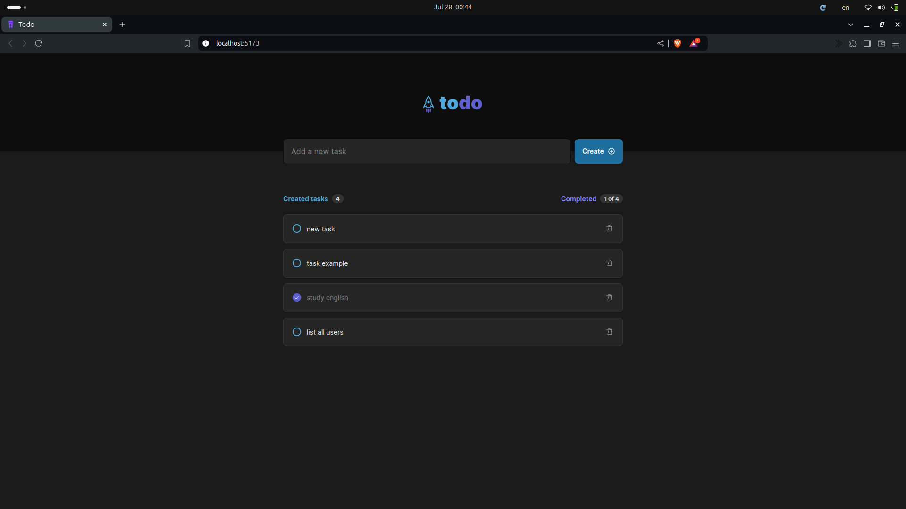
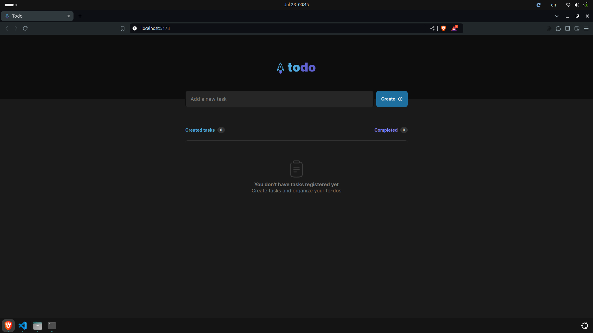

# TODO

## 👀 Como ficou ???

</img>
----------
</img>
----------

## 🧑‍💻 Tecnologias usadas

O projeto foi desenvolvido com as seguintes tecnologias:
- [TypeScript](https://www.typescriptlang.org/)
- [React JS](https://pt-br.reactjs.org/)

## ⌨️ Sobre o projeto

O projeto Todo é uma aplicação web desenvolvida em React, projetada para ajudar os usuários a gerenciar suas tarefas diárias de forma eficiente. A interface do usuário é intuitiva e amigável, permitindo adicionar, marca como concluída e excluir tarefas com facilidade. 

## Rodar o projeto

Primeiramente é necessário ter o node, caso não tenha faça a instalação dele. [NODE](https://nodejs.org/en/download/) 

## `npm install`

É necessário dar um "npm install" ou "npm i", para instalar as depêndencias do projeto.

## `npm run dev`

Depois de ter instalado as dependências, basta dar um "npm start", para rodar o projeto em modo desenvolvedor. Abra [http://localhost:5173](http://localhost:5173) para vê o projeto em seu navegador.
